Quan-RPC设计文档
================

代码仓库：https://github.com/2776115684/Quan-RPC-Framework.git

Quan-RPC
是一款使用Java实现的基于TCP协议的远程过程调用（RPC）框架，用于在分布式系统中实现服务的远程调用。它通过自定义的协议、借助自定义的服务注册中心在客户端和服务器之间传递数据，确保可靠的通信和高效的服务调用。

开发环境：
----------

操作系统：Windows 11

编程语言：Java

软件开发工具包：JDK11（本项目使用Amazon Corretto 11）

集成开发环境（IDE）：IntelliJ IDEA 2023.2.1

项目管理工具：Maven

容器化工具：Docker、Docker Compose

版本控制：Git

项目模块：
----------

rpc-api ------ 服务端与客户端的公共调用接口

rpc-common ------ 实体对象、公共工具类、枚举类、自定义异常类

rpc-core ------ Quan-RPC框架的核心实现

test-client ------ 客户端测试代码

test-server ------ 服务端测试代码

项目运行教程：
--------------

启动命令：

服务注册中心：java -jar registry.jar

服务端：java -jar server.jar -l 192.168.1.11 -p 15555

客户端：java -jar client.jar -i 192.168.1.16 -p 12375

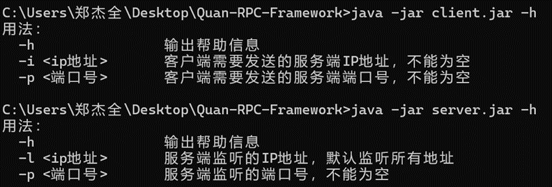

Quan-RPC整体架构图
------------------

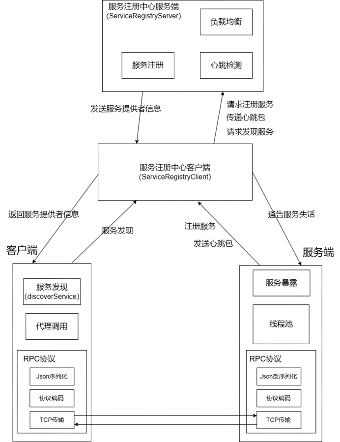

消息格式定义，消息序列化和反序列化
----------------------------------

### 消息格式定义

Quan-RPC框架在客户端和服务器之间传递数据时，采用自定义的消息格式（防止粘包）。该消息格式通过在对象的字节序列前添加一些特定的元数据，确保数据的完整性和可读性。以下是详细的消息格式定义：

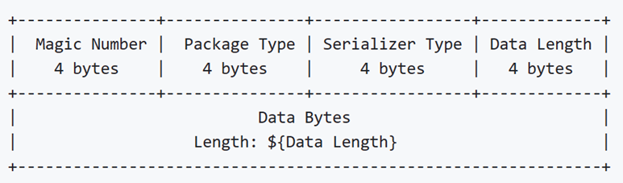

每个消息包都包含以下几个部分：

1.  **魔数 (Magic Number)：**
    长度4字节，用于验证协议包的合法性，防止错误的数据包被处理。

值设置为0xCAFEBABE

2.  **包类型 (Package Type)：**

长度4字节，用于区分请求包和响应包。

> REQUEST\_PACKAGE(0); // 0表示请求包
>
> RESPONSE\_PACKAGE(1); // 1表示响应包

3.  **序列化器代码 (Serializer Code)：**

长度4字节，标识使用的序列化器，使接收方能够正确反序列化数据。

值为1（目前只支持Json序列化，后续可拓展支持多重序列化器）。

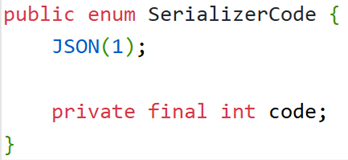

4.  **数据长度 (Data Length)：**

长度4字节，表示后续数据的字节长度，便于接受方准确读取数据。

5.  **数据 (Data)：**

> 长度可变，存储的是实际序列化后的对象数据
>
> （包括RpcRequest和RpcResponse）

RpcRequest类的属性如下：

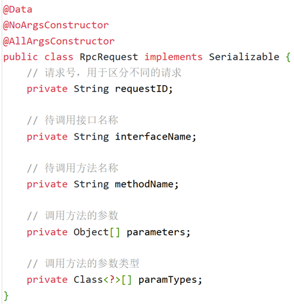

RpcResponse类的属性如下（省去操作部分的展示）：

### 消息序列化和反序列化

在本项目中，我定义了一个通用的序列化反序列化接口CommonSerializer，可支持不同序列化器的实现；出于复杂性的考虑，目前只实现了使用JSON格式的序列化器JsonSerializer，用于将Java对象转换为JSON格式（序列化），将JSON格式转换为Java对象（反序列化）。

此外，在实现消息传输的过程中，我创建了一个工具包，里面包含了ObjectWriter和ObjectReader两个类，分别用于将Java对象序列化并写入输出流和从输入流中读取字节数据并反序列化为Java对象。

1.  **消息序列化**

> JsonSerializer类提供的serialize方法：
>
> 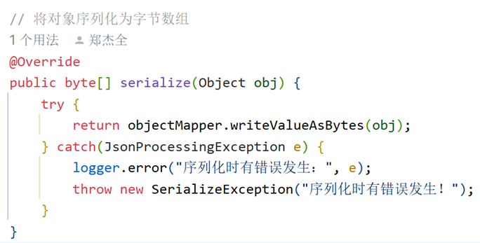
>
> ObjectWriter类提供的writeObject方法：
>
> 其主要作用是将 Java
> 对象序列化并通过输出流发送到网络的另一端。在序列化过程中，该类会在对象字节数据前添加魔数、包类型、序列化器代码和数据长度等元数据，以确保接收方能够正确地解析和反序列化数据。
>
> 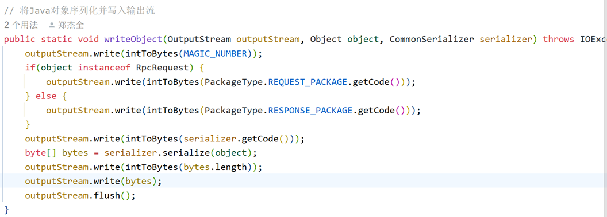

2.  **消息反序列化**

> JsonSerializer类提供的deserialize方法：
>
> 
>
> ObjectReader类提供的readObject方法：
>
> 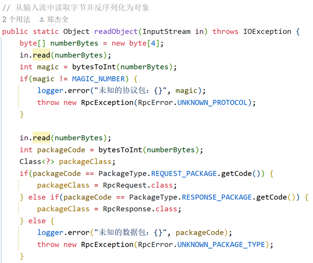
>
> 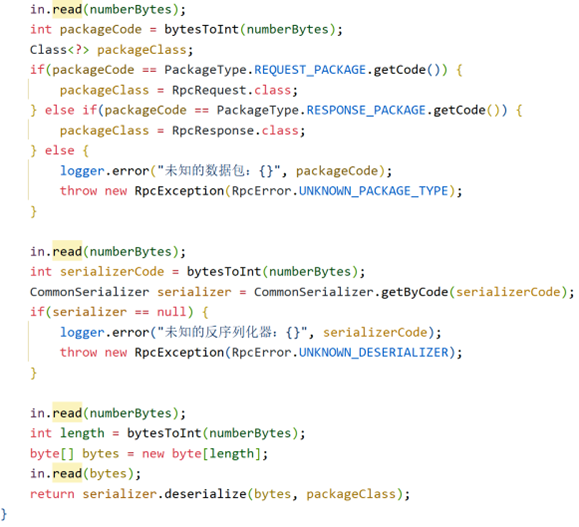
>
> 其主要作用是从输入流中读取字节数据，并根据自定义的消息格式将其反序列化为
> Java
> 对象。这包括验证协议包的合法性、识别包类型、选择合适的反序列化器以及将字节数据反序列化为具体的请求或响应对象。

服务注册
--------

在实现服务注册这一功能时，我定义了一个服务注册表通用接口ServiceRegistry，并将其实现为QuanServiceRegistry；

QuanServiceRegistry服务注册表类中有两个ConcurrentHashMap，用于存储服务的相关信息（包括心跳信息），该服务注册表类还提供服务注册、服务发现、心跳处理的功能。

而在服务端注册服务的过程中，我们会首先将服务注册到服务注册中心上，即服务端调用服务注册中心客户端的注册服务函数向服务注册中心服务端发送注册服务请求，服务注册中心服务端接收到请求后，将服务及其提供者的地址存储到一个全局的服务注册表中；接着，服务端会在维护一个本地服务注册表，然后将该服务注册到本地服务注册表中。

（注：服务注册中心客户端的信息对提供服务的服务端是透明的）

服务注册中心客户端相当于是提供服务的服务端和服务注册中心服务端（内有全局服务注册表）通信的媒介。

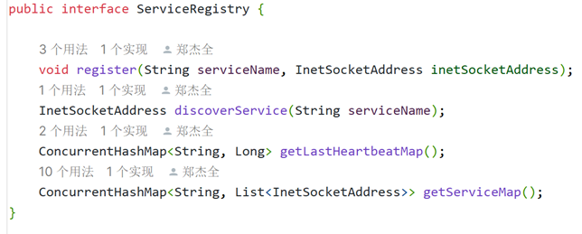

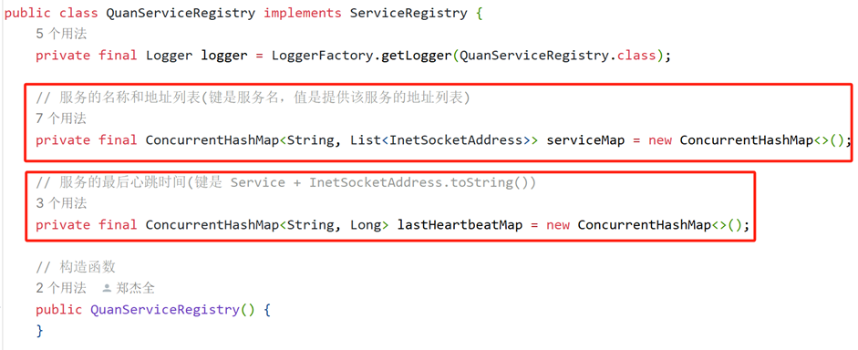

### 服务注册的步骤

1. 实例化服务注册中心客户端

   a.  在RpcServer的构造函数中，创建ServiceRegistryClient对象，连接到服务注册中心；

2. 发布服务

​	a.  使用RpcServer类的publishService方法注册服务

​	b.  在该方法中，首先将服务注册到注册中心**（加分项）**，然后将服务添加到本地的ServiceProvider和ServiceRegistry中

3. 将服务注册到服务注册中心（对应2中的b步骤中的前一步）

   a.  使用ServiceRegistryClient的register方法，利用socket套接字将服务名和地址发送到服务注册中心服务端；

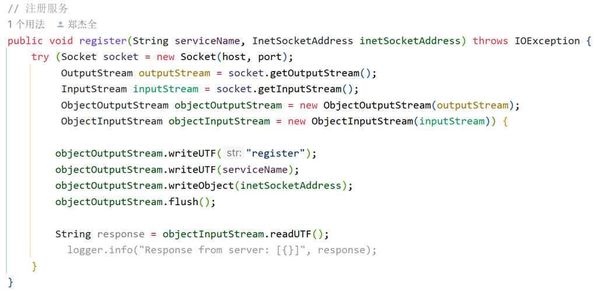

b.  ServiceRegistryClient向ServiceRegistryServer发送注册服务的消息，服务注册中心服务端接收到消息后将该服务及其服务提供者的地址存入全局服务注册表（唯一的）中，以下是服务注册中心服务端接受到注册请求时的动作：

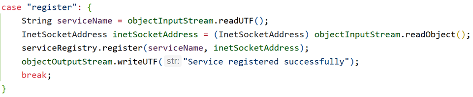

4. 将服务添加到本地的服务提供者和服务注册表（对应2中的b步骤中的后一步）

   a.  在ServiceProvider中添加服务实现；

   b.  在ServiceRegistry中添加服务名和地址（本地服务注册表便于在心跳检测时发现服务失活后删去对应的服务，且一个服务端可以提供多种服务）

### 数据结构

服务注册表类QuanServiceRegistry：

1\. **ConcurrentHashMap**\<String, List\<InetSocketAddress\>\>
**serviceMap**：用于存储每个服务名对应的多个服务地址。

键：服务名（String）；

值：提供该服务的地址列表（List\<InetSocketAddress\>）。

2\. **ConcurrentHashMap**\<String, Long\>
**lastHeartbeatMap**：用于存储每个服务实例的最后心跳时间。

键：服务名和地址的组合字符串（String）；

值：最后心跳时间（Long）。

这两个数据结构是QuanServiceRegistry类的属性，该类主要负责管理服务注册信息和心跳信息，是一个服务注册表的自定义实现类；而ServiceRegistryServer是服务注册中心的服务端，负责监听ServiceRegistryClient服务注册中心客户端的请求，其中有一个全局的服务注册表进行具体的服务管理操作。

很显然，该数据结构支持服务端至少能同时支持注册10个以上的函数。

### 注册服务的接口

服务端通过调用RpcServer类里的publishService发布服务方法（在前文注册服务步骤里的第二步有图示）即可实现注册服务的功能，以下是服务端测试代码注册服务的例子：

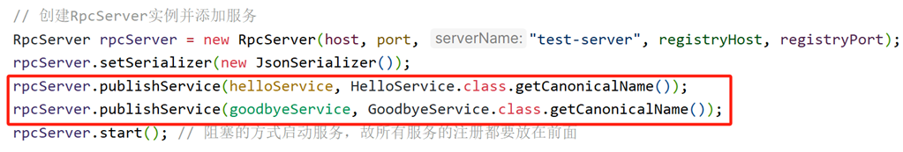

服务发现
--------

### 服务发现的步骤

1\. 客户端请求服务发现：

客户端通过ServiceRegistryClient类向服务注册中心发送服务发现请求；

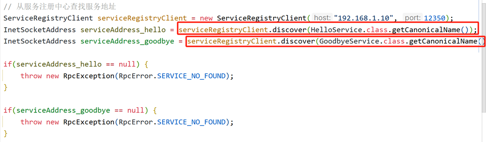

ServiceRegistryClient类的discover方法实现如下：

服务注册中心客户端向服务注册中心服务端发送服务发现请求，然后等待服务注册中心服务端的回复，并将回复的消息（服务提供者的网络信息）反序列化为Java对象然后返回给客户端。

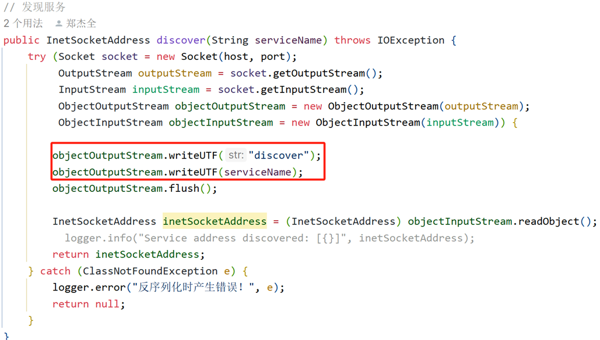

2\. 服务注册中心服务端接受请求并处理：

以下截取了ServiceRegistryServer类中的ServiceRegistryServerHandler内部类处理ServiceRegistryClient的服务发现请求的代码：

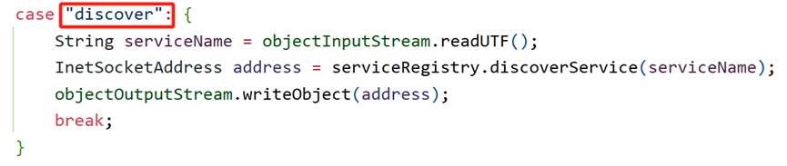

discoverService方法的实现如下：

在全局服务注册表中查询对应服务名称的所有服务提供者的网络地址，然后在符合条件的所有网络地址中随机选择一个返回给服务注册中心客户端，然后服务注册中心客户端再将其传递给客户端。因此，在服务注册中心服务端上，我们通过使用随机选择策略实现了负载均衡。

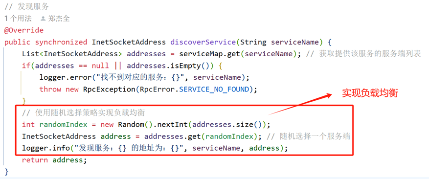

### 服务发现的接口

客户端通过调用ServiceRegistryClient服务注册中心客户端的discover函数便可实现服务发现功能，具体代码在服务发现的步骤中有展示。

### 服务端如何从数据结构中找到服务

QuanServiceRegistry类使用ConcurrentHashMap\<String,
List\<InetSocketAddress\>\>来存储服务名称和服务地址列表。

详细过程：

1\. 获取服务地址：

从serviceMap中根据服务名获取服务地址列表。

2\. 检查服务是否存在：

> 如果服务地址列表为空或不存在，抛出RpcException异常，表示找不到对应的服务。

3\. 负载均衡：

使用随机选择策略，从地址列表中随机选择一个地址，实现负载均衡。

4\. 返回服务地址：

将选中的服务地址返回给客户端。

服务调用
--------

### 输入和输出的数据结构

1\.
RpcRequest类是服务调用的输入数据结构，表示客户端发起的远端调用请求，包含了请求号、调用接口的信息、方法名称、参数和参数类型。

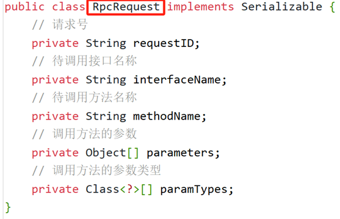

2\.
RpcResponse类是服务调用的输出数据结构，表示服务端处理请求后返回的响应结果，包含了响应状态码、响应消息和实际的数据结果。

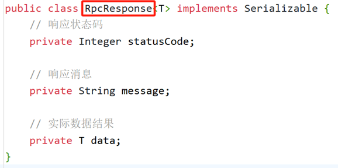

### 请求消息和响应结果的组织方式

请求消息和响应结果通过ObjectWriter和ObjectReader类进行序列化和反序列化，并通过网络传输。具体代码已在第二部分的消息序列化和反序列化展示。

### 服务调用的步骤

前提是客户端已通过服务发现查找到了服务提供者的地址。

1\. 创建RpcClient

·创建RpcClient对象，并连接到发现的服务提供者地址

·设置序列化器

2\. 使用代理调用服务

·创建RpcClientProxy对象，获取服务的代理对象

-   调用代理对象的方法，实际是通过动态代理机制，将方法调用转换为RPC请求

3\. 发送请求和接收响应

> ·RpcClientProxy类的invoke方法创建RpcRequest对象，并调用RpcClient的sendRequest方法发送请求

·RpcClient通过ObjectWriter将RpcRequest对象序列化并写入输出流

> ·服务端处理请求后，通过ObjectReader读取并将RpcResponse序列化发送给客户端

以下是RpcClientProxy类的实现

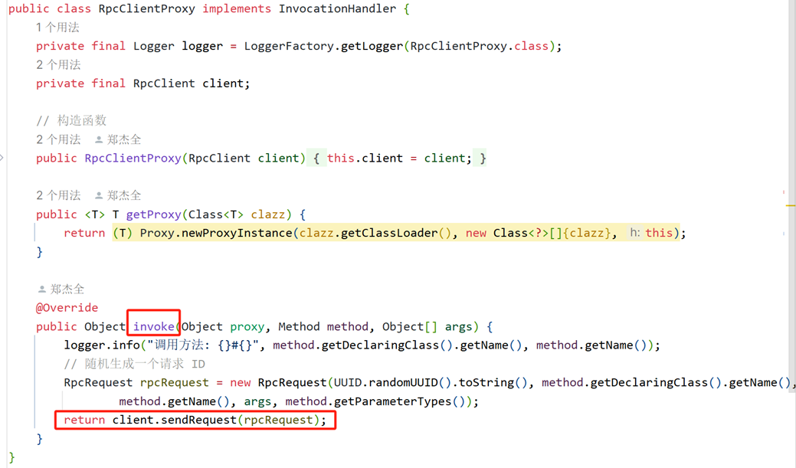

服务注册中心（加分项）
----------------------

### 服务注册的步骤

服务注册的步骤已经在第三部分服务注册中详细说明了。

### 服务保活机制

Quan-RPC框架下服务的注册是非永久的，而是通过心跳检测来实现服务保活。服务注册中心会定期检查服务的状态，并根据心跳检测的结果决定是否保持服务的注册状态。如果一个服务在一定时间内没有发送心跳包，则认为该服务失活，并将其从服务注册中心移除（全局服务注册表和本地服务注册表都移除该服务）。

**·心跳检测：**

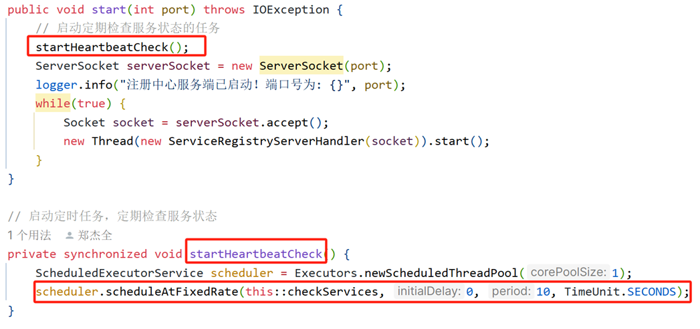

ServiceRegistryServer类中有一个定时任务，定期检查每个服务的心跳时间。如果当前时间与最后心跳时间的差值超过了SERVICE\_TIMEOUT，则认为该服务失活，并将其从服务注册中心移除。

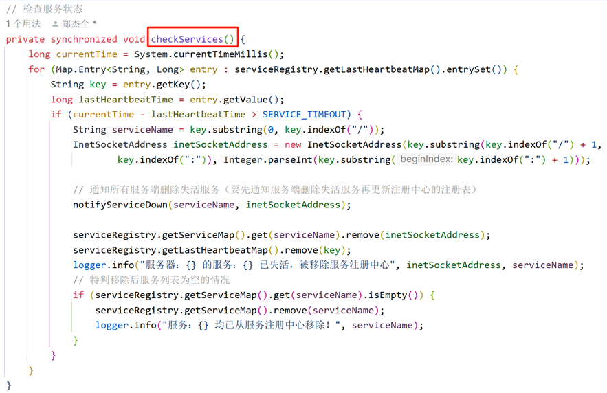

**·发送心跳包**

RpcServer类中包含一个定时任务，定期向服务注册中心发送心跳包，更新服务的最后心跳时间。

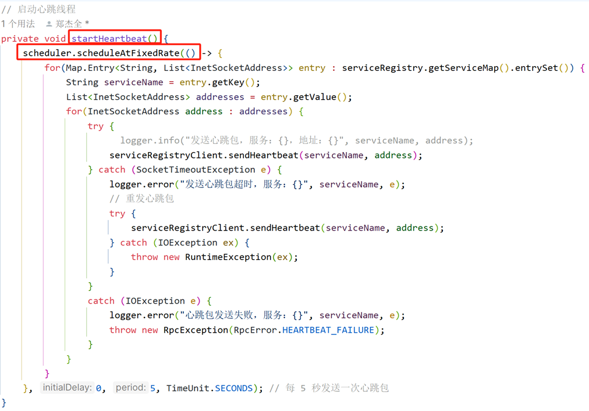

**·接受心跳包并更新心跳时间**

在ServiceRegistryServer类中，接收到心跳包后，调用QuanServiceRegistry类的heartbeat方法，更新服务的最后心跳时间。

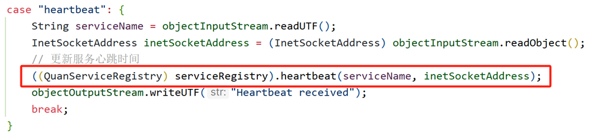

**·更新心跳时间**

支持并发
--------

### 多线程与线程池

Quan-RPC框架通过创建新的线程来处理每个客户端的请求，实现了基本的并发处理。此外，还是用了线程池来管理和调度线程，以提高并发性能和资源利用效率。

注：在后续第九部分负载均衡的docker镜像测试中我们有10个客户端并发调用服务，测试截图将在第九部分展示。

**1. 多线程处理客户端请求**

> ·在RpcServer类中，每当有一个新的每当有一个新的客户端连接请求到达时，服务端会创建RequestHandlerThread线程（处理RpcRequest的工作线程）来处理该请求。
>
> 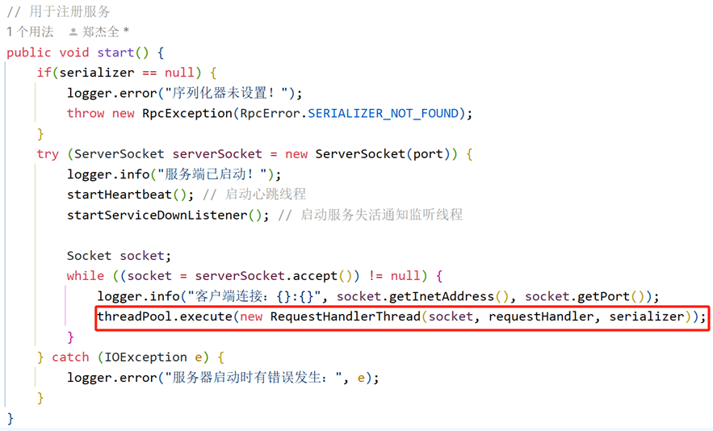
>
> ·在ServiceRegistryServer类中，每当有一个新的服务注册中心客户端连接请求到达时，服务注册中心服务端会创建一个新的线程来处理该请求。
>
> 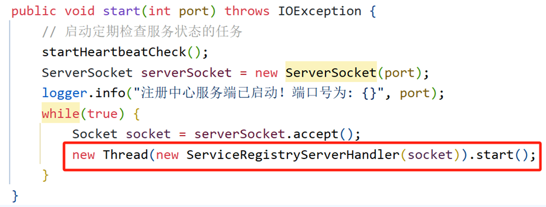

**2. 使用线程池**

> ·在RpcServer类中，使用了线程池来处理并发请求。线程池通过ThreadPoolFactory创建，并在服务器启动时初始化。

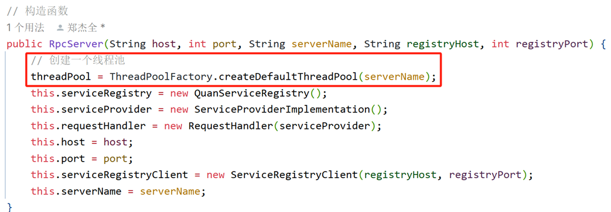

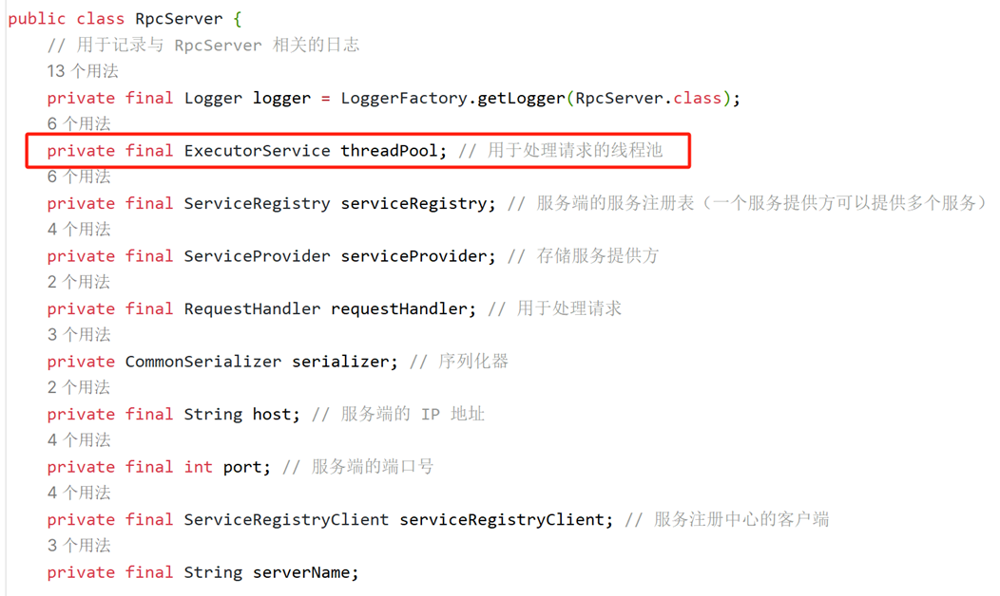

在当前的Quan-RPC框架中，并没有使用IO多路复用技术，而是采用了比较简单直接的多线程和线程池方式来实现并发处理，这是因为该方式较为简单，易于维护和调试，对于中小规模的并发请求能提供足够的性能和吞吐量。

异常处理及超时处理
------------------

Quan-RPC框架中，异常和超时处理事通过在关键点添加异常捕获和处理代码实现的。这些关键点包括网络连接、数据传输和请求处理等。

### 客户端处理异常/超时

**1. 与服务端建立连接时产生的异常/超时**

在RpcClient类中，通过Socket类的connect方法建立连接，设置连接超时时间connectTimeout并捕获SocketTimeoutException和IOException异常

> ·**连接超时**：捕获SocketTimeoutException并抛出RpcException异常，错误码为RpcError.SOCKET\_TIMEOUT
>
> ·**连接错误**：捕获IOException并抛出RpcException异常，错误码为
> RpcError.SOCKET\_ERROR

**2. 发送请求到服务端，写数据时出现的异常/超时**

在发送请求时，通过ObjectWriter.writeObject方法将数据写入输出流，捕获IOException和
ocketTimeoutException异常

> ·**写数据超时：**捕获SocketTimeoutException并抛出RpcException异常，错误码为RpcError.IO\_TIMEOUT
>
> ·**写数据错误：**捕获IOException并抛出RpcException异常，错误码为RpcError.IO\_ERROR。

**3. 等待服务端处理室，等待处理导致的异常/超时**

通过设置socket.setSoTimeout(readTimeout)来设置读取超时时间，等待服务端处理时，如果超时会抛出SocketTimeoutException。

> ·**读取超时：**捕获SocketTimeoutException并抛出 RpcException
> 异常，错误码为RpcError.IO\_TIMEOUT。

**4. 从服务端接收响应时，读数据导致的异常/超时**

在读取响应数据时，通过ObjectReader.readObject方法从输入流中读取数据，捕获IOException和ClassNotFoundException异常。

> ·**读数据超时：**捕获SocketTimeoutException并抛出RpcException异常，错误码为RpcError.IO\_TIMEOUT。
>
> ·**读数据错误：**捕获IOException并抛出RpcException异常，错误码为RpcError.IO\_ERROR。
>
> ·**反序列化错误：**捕获ClassNotFoundException并抛
> RpcException异常，错误码为RpcError.UNKNOWN\_DESERIALIZER。

具体代码如下：

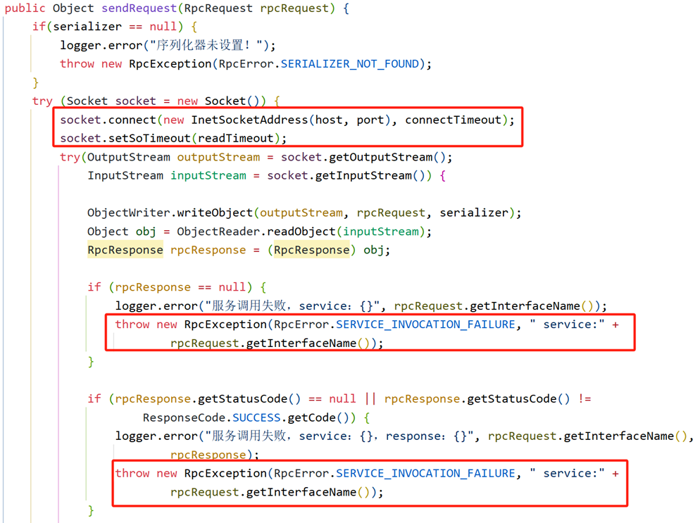

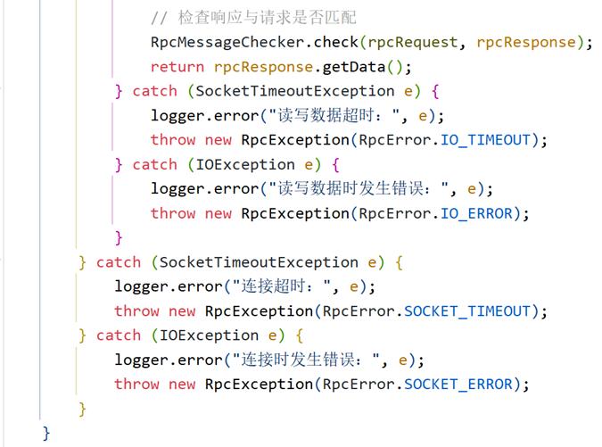

### 服务端处理异常/超时

**1. 读取客户端请求数据，读数据导致的异常/超时**

在ServiceRegistryServerHandler类中，通过ObjectInputStream读取客户端请求数据时，捕获IOException和ClassNotFoundException异常。

·**读数据错误：**捕获IOException并记录错误日志。

·**反序列化错误：**捕获ClassNotFoundException并记录错误日志。

具体代码如下：（在截图时把一些无关异常/超时处理的代码隐藏了）

**2. 发送响应数据时，写数据导致的异常/超时**

在 ServiceRegistryServerHandler 类中，通过 ObjectOutputStream
发送响应数据时，捕获 IOException 异常。

·**写数据错误：**捕获IOException并记录错误日志。

具体代码同上。

**3. 调用映射服务的方法时，处理数据导致的异常/超时**

在RequestHandler类中，处理客户端请求时，如果发生异常，捕获并记录错误日志，同时生成相应的错误响应返回给客户端。

> ·**反射调用错误：**捕获NoSuchMethodException、IllegalAccessException和
> InvocationTargetException并抛出RpcException异常，错误码为RpcError.SERVICE\_INVOCATION\_FAILURE。

具体代码如下：

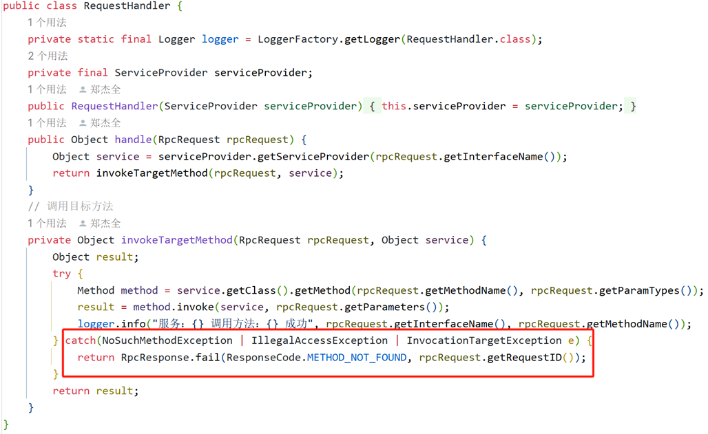

负载均衡（加分项）
------------------

### 随机选择策略的负载均衡

Quan-RPC框架下，在QuanServiceRegistry类中，服务发现方法discoverService实现了简单的随机负载均衡。在获取到提供某个服务的所有服务端地址后，随机选择一个地址进行返回。

具体在第四部分服务发现中有详细介绍。

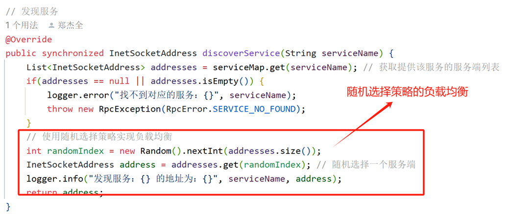

在多个服务提供者中随机选择一个进行调用，这种方式简单但有效，可以在一定程度上平衡负载。

以下是在使用多个docker镜像进行的测试：

1个服务注册中心，3个服务端（都提供两个服务HelloService和ByeService），10个客户端：

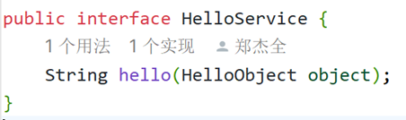

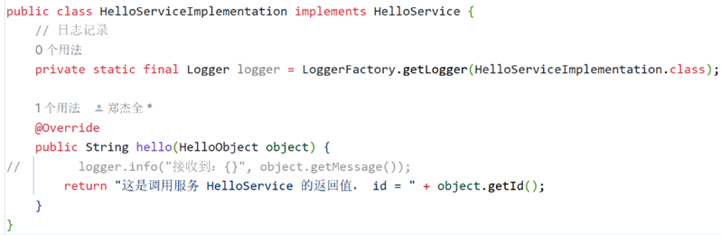

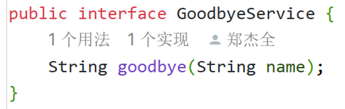

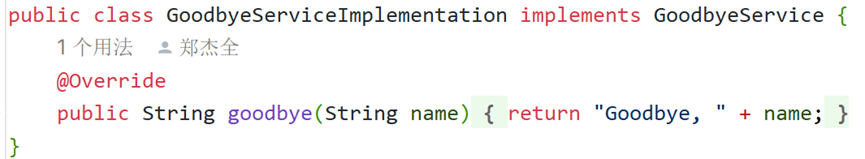

docker-compose.yml中3个服务器的配置如图所示：

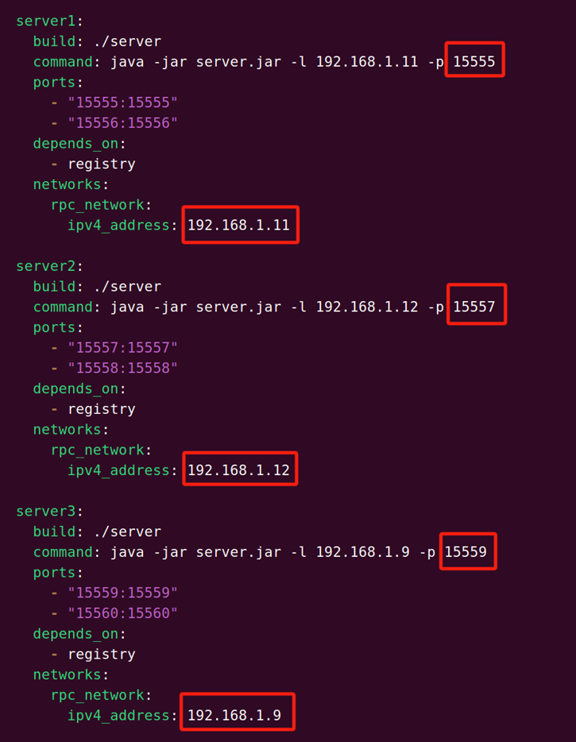

测试结果：

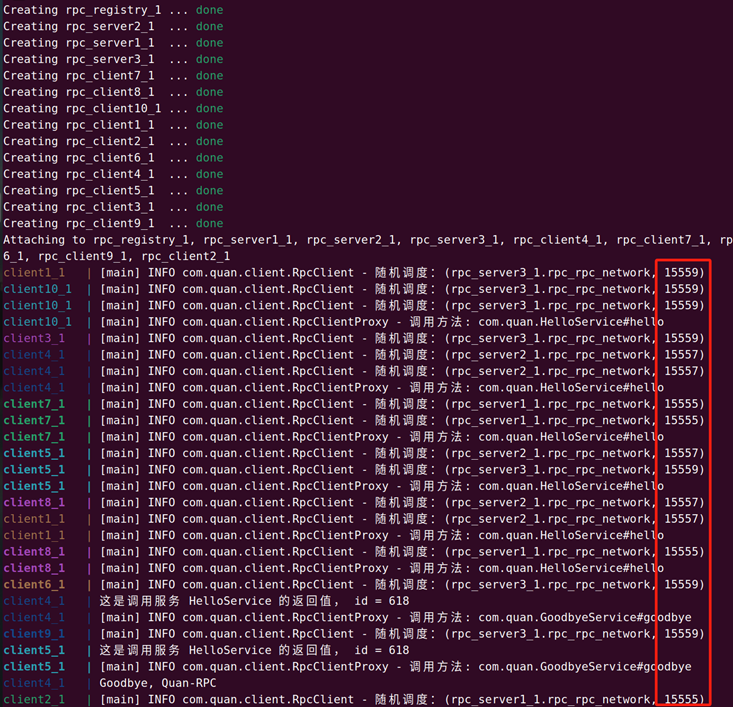

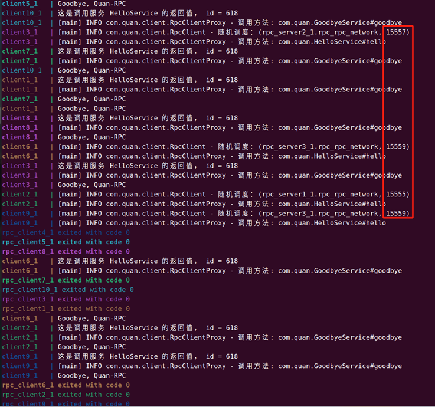

十、网络传输层协议
------------------

Quan-RPC框架使用的传输层协议是TCP；在RpcServer和RpcClient类的代码使用了ServerSocket和Socket类，这些类都属于Java的java.net包，并且都是基于TCP协议进行通信的。

### 使用TCP协议的原因

TCP（传输控制协议）是一种面向连接的可靠传输协议，具有以下特定：

·可靠性：TCP提供可靠的数据传输，确保数据包按发送顺序到达，并且没有丢失或重复。

·流量控制：TCP通过流量控制机制防止网络拥塞。

·错误检测：TCP使用校验和进行错误检测，以确保数据传输的完整性。

·面向连接：在传输数据前，TCP需要在客户端和服务器之间建立连接，通过三次握手完成；而通过四次挥手释放连接；确保了连接的可靠建立和可靠释放，有助于避免数据传输过程中的混乱和不一致。

·全双工通信：TCP协议允许双方同时发送和接收数据，实现全双工通信。